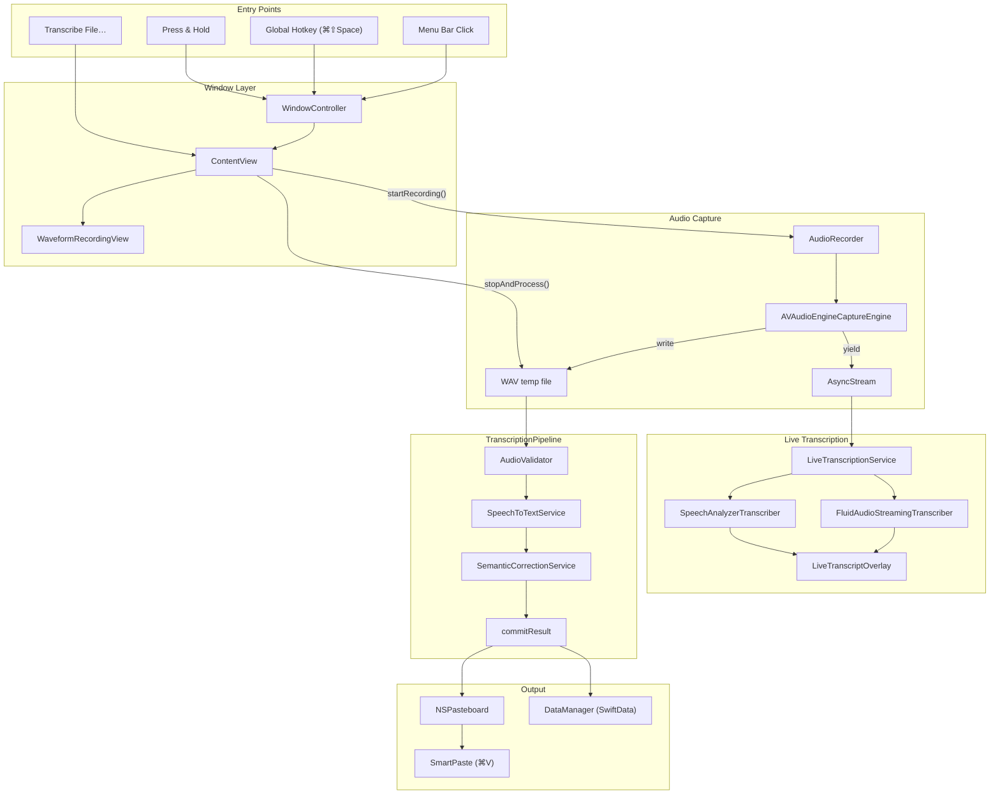
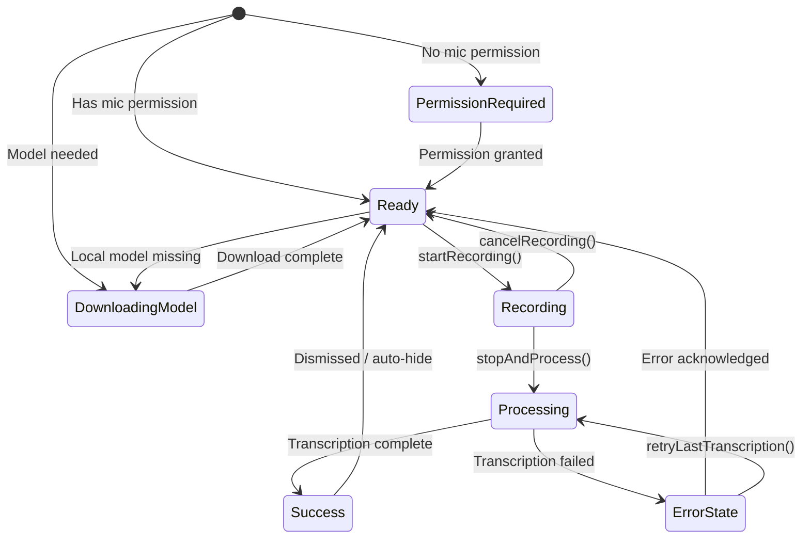

# Recording Flow — Technical Documentation

This document describes AudioWhisper's critical recording pipeline: from user
input through audio capture, live transcription, post-recording transcription,
semantic correction, and final output (pasteboard/SmartPaste).

---

## Architecture Overview



---

## Component Reference

### Entry Points

| Component | File | Purpose |
|-----------|------|---------|
| HotKeyManager | `Sources/Managers/HotKeyManager.swift` | Registers global hotkey, fires `handleHotkey()` |
| PressAndHoldKeyMonitor | `Sources/Managers/PressAndHoldKeyMonitor.swift` | Monitors modifier key hold/toggle for recording |
| KeyboardEventHandler | `Sources/Managers/KeyboardEventHandler.swift` | Posts Space/Escape/Return key notifications when recording window is visible |
| AppDelegate+Hotkeys | `Sources/App/AppDelegate+Hotkeys.swift` | Routes hotkey/press-and-hold to recording window or direct recording |

### Window Layer

| Component | File | Purpose |
|-----------|------|---------|
| WindowController | `Sources/Managers/Windows/WindowController.swift` | Shows/hides recording window, stores target app for SmartPaste |
| ContentView | `Sources/Views/ContentView.swift` | Root view; owns `AudioRecorder`, `LiveTranscriptionService`, `TranscriptionPipeline` |
| ContentView+Recording | `Sources/Views/ContentView+Recording.swift` | Orchestrates start/stop/process/retry flows |
| ContentView+Lifecycle | `Sources/Views/ContentView+Lifecycle.swift` | Sets up notification observers, handles appear/disappear |
| ContentView+Paste | `Sources/Views/ContentView+Paste.swift` | SmartPaste target-app resolution and CGEvent paste |
| ContentView+Status | `Sources/Views/ContentView+Status.swift` | Maps recorder/processing state to `AppStatus` |

### Audio Capture

| Component | File | Threading | Purpose |
|-----------|------|-----------|---------|
| AudioRecorder | `Sources/Services/Audio/AudioRecorder.swift` | `@MainActor` | Owns engine lifecycle, WAV writing, `AsyncStream<AudioData>` production |
| AudioCaptureEngine (protocol) | `Sources/Services/Audio/AudioCaptureEngine.swift` | Any | Abstracts `AVAudioEngine` for testability |
| AVAudioEngineCaptureEngine | `Sources/Services/Audio/AudioCaptureEngine.swift` | Any | Production engine with CoreAudio device selection |
| AudioData | `Sources/Services/Audio/AudioData.swift` | `Sendable` | `AVAudioPCMBuffer` + `AVAudioTime` tuple |

### Live Transcription

| Component | File | Purpose |
|-----------|------|---------|
| LiveTranscriptionService | `Sources/Services/LiveTranscription/LiveTranscriptionService.swift` | Orchestrator; selects backend, accumulates transcript |
| LiveTranscriptionBackend (protocol) | `Sources/Services/LiveTranscription/LiveTranscriptionBackend.swift` | Backend contract: `start(audioStream:)` → `AsyncStream<LiveTranscriptionUpdate>` |
| FluidAudioStreamingTranscriber | `Sources/Services/LiveTranscription/FluidAudioStreamingTranscriber.swift` | FluidAudio Parakeet streaming ASR |
| SpeechAnalyzerTranscriber | `Sources/Services/LiveTranscription/SpeechAnalyzerTranscriber.swift` | Apple SpeechAnalyzer (macOS 26+) |
| FluidAudioModelManager | `Sources/Services/LiveTranscription/FluidAudioModelManager.swift` | Parakeet v3 model download/delete/status |

### Post-Recording Pipeline

| Component | File | Purpose |
|-----------|------|---------|
| TranscriptionPipeline | `Sources/Services/TranscriptionPipeline.swift` | Shared pipeline: transcribe → correct → commit |
| SpeechToTextService | `Sources/Services/SpeechToTextService.swift` | Routes to OpenAI/Gemini/Local Whisper/Parakeet |
| SemanticCorrectionService | `Sources/Services/SemanticCorrectionService.swift` | Cloud or local MLX post-correction |
| AudioValidator | `Sources/Services/Audio/AudioValidator.swift` | Validates format, corruption, file size |
| AudioProcessor | `Sources/Services/Audio/AudioProcessor.swift` | Loads audio to `[Float]` for Parakeet/Whisper |

### Output

| Component | File | Purpose |
|-----------|------|---------|
| PasteManager | `Sources/Managers/PasteManager.swift` | SmartPaste via CGEvent ⌘V simulation |
| DataManager | `Sources/Stores/DataManager.swift` | SwiftData persistence for transcription history |
| UsageMetricsStore | `Sources/Stores/UsageMetricsStore.swift` | Session counts, word/char totals, time-saved estimates |

---

## State Machine

AudioWhisper uses `AppStatus` to drive the recording window UI. States have
strict priority ordering (highest-priority match wins):



### Priority Order (evaluated in `StatusViewModel.updateStatus()`)

1. **Error** — `errorMessage` is non-nil
2. **Success** — `showSuccess` is true
3. **Recording** — `audioRecorder.isRecording`
4. **Processing** — `isProcessing` (with `progressMessage`)
5. **Permission Required** — `!hasPermission`
6. **Downloading Model** — model download in progress
7. **Ready** — default idle state

---

## Audio Data Flow

### Recording Phase

```
AVAudioEngine.inputNode
    │  installTap(bufferSize: 4096)
    ▼
handleCapturedBuffer(buffer, time)    ← real-time audio thread
    │
    ├─► AVAudioFile.write(from: buffer)   → /tmp/recording_{timestamp}.wav
    │
    ├─► continuation.yield(AudioData)     → AsyncStream<AudioData>
    │                                         │
    │                                         ▼
    │                                    LiveTranscriptionService
    │                                         │
    │                                    ┌────┴────┐
    │                                    ▼         ▼
    │                               FluidAudio  SpeechAnalyzer
    │                               (Parakeet)  (macOS 26+)
    │                                    │         │
    │                                    ▼         ▼
    │                               LiveTranscriptionUpdate
    │                                    │
    │                                    ▼
    │                          LiveTranscriptOverlay (UI)
    │
    └─► audioLevel (RMS)                 → WaveformRecordingView bars
```

### Post-Recording Phase (TranscriptionPipeline)

```
WAV file URL
    │
    ▼
AudioValidator.validateAudioFile()
    │
    ▼
SpeechToTextService.transcribeRaw()
    │
    ├─ .openai  → Alamofire multipart → api.openai.com
    ├─ .gemini  → Inline (<5MB) or Files API (>10MB) → generativelanguage.googleapis.com
    ├─ .local   → WhisperKit (CoreML) with optional diarization
    └─ .parakeet → MLDaemonManager (Python subprocess)
    │
    ▼
Raw transcription text
    │
    ▼
SemanticCorrectionService.correctWithWarning()
    │
    ├─ .off       → pass-through
    ├─ .localMLX  → MLDaemonManager → Qwen3-1.7B-4bit
    └─ .cloud     → OpenAI GPT or Gemini (only for cloud STT providers)
    │
    ▼
safeMerge(original, corrected, maxChangeRatio)
    │
    ▼
Final text
    │
    ├─► NSPasteboard.general.setString()
    ├─► DataManager.saveTranscriptionQuietly()  (if history enabled)
    ├─► UsageMetricsStore.recordSession()
    └─► SmartPaste: CGEvent ⌘V → target app
```

---

## Concurrency Model

### Actor Boundaries

| Owner | Isolation | What It Protects |
|-------|-----------|------------------|
| ContentView | `@MainActor` (implicit) | All `@State`/`@Published` view state |
| AudioRecorder | `@MainActor` | `isRecording`, `audioLevel`, `hasPermission`, engine lifecycle |
| AudioRecorder.handleCapturedBuffer | `nonisolated` | Runs on the real-time audio thread; uses `fileLock` (NSLock) to protect `audioFile` and `audioDataContinuation` |
| LiveTranscriptionService | `@MainActor` | `finalizedTranscript`, `volatileTranscript`, `isActive` |
| FluidAudioStreamingTranscriber | `Sendable` | Owned `Task`s manage their own state; `StreamingAsrManager` is actor-isolated internally |
| TranscriptionPipeline | No isolation | Stateless; called from `@MainActor` tasks |
| DataManager | `@MainActor` | SwiftData `ModelContainer` |

### Key Threading Rules

1. **Audio tap callback** runs on a real-time CoreAudio thread. Only `fileLock`-
   protected fields (`audioFile`, `audioDataContinuation`) may be accessed.
   The RMS level update dispatches to `@MainActor` via `Task`.

2. **`processingTask`** runs on a cooperative thread pool but updates UI state
   only on `@MainActor` (the enclosing view is implicitly MainActor).

3. **Detached tasks** in `retryLastTranscription` use `Task.detached` to run
   correction in the background. They capture all needed values explicitly and
   return to `@MainActor` via `MainActor.run` for UI updates.

4. **FluidAudio streaming** spawns two internal tasks (`feedTask` for audio
   consumption, `updateTask` for transcription updates). Both are cancelled in
   `finish()`.

---

## Error Handling Matrix

| Scenario | Detection | User-Facing Behavior |
|----------|-----------|---------------------|
| No microphone permission | `AVCaptureDevice.authorizationStatus` | Education modal → System Settings |
| Permission denied/restricted | `hasPermission == false` | Recovery modal with steps |
| Engine start fails | `engine.start() throws` | Single retry (200ms); then error alert |
| Mic unplugged mid-recording | `AVAudioEngineConfigurationChange` | Attempt engine restart; set `deviceDisconnected` if restart fails |
| Selected mic not found | `audioDeviceID(for:)` returns nil | Silently falls back to system default |
| Audio file invalid/corrupt | `AudioValidator.validateAudioFile` | `SpeechToTextError.transcriptionFailed` → error alert |
| OpenAI/Gemini API key missing | Keychain lookup returns nil | `SpeechToTextError.apiKeyMissing` → error alert |
| Cloud transcription fails | Alamofire response failure | `SpeechToTextError.transcriptionFailed` → error alert |
| Local Whisper model not downloaded | `WhisperKitStorage.isModelDownloaded` | Error alert + open Settings → Providers |
| Parakeet model not ready | `ParakeetError.modelNotReady` | Error alert + open Settings → Providers |
| Semantic correction fails (local) | MLX subprocess error | Warning in progress message; raw text used |
| Semantic correction too divergent | `safeMerge` edit distance > threshold | Original text kept; correction discarded |
| Model download timeout | 20-minute polling timeout | `SpeechToTextError.transcriptionFailed` |
| File too large for inline Gemini | `fileSize > 5MB` | `SpeechToTextError.fileTooLarge` |
| Task cancelled (user presses Esc) | `CancellationError` | Processing state reset; no error shown |

---

## Configuration Surface

All recording-related settings stored via `UserDefaults` / `@AppStorage`:

| Key | Type | Default | Effect |
|-----|------|---------|--------|
| `transcriptionProvider` | `TranscriptionProvider` | `.local` | Which STT backend to use |
| `selectedWhisperModel` | `WhisperModel` | `.base` | Which WhisperKit model (when provider is `.local`) |
| `selectedParakeetModel` | `ParakeetModel` | `.v3Multilingual` | Parakeet model variant |
| `liveTranscriptionProvider` | `LiveTranscriptionProvider` | `.off` | Live transcription backend |
| `selectedMicrophone` | `String` | `""` (system default) | CoreAudio device UID for input |
| `enableSmartPaste` | `Bool` | `false` | Auto-paste into target app after transcription |
| `immediateRecording` | `Bool` | `false` | Hotkey starts recording directly (no window tap) |
| `globalHotkey` | `String` | `"⌘⇧Space"` | Global keyboard shortcut |
| `pressAndHoldEnabled` | `Bool` | `false` | Enable hold-to-record |
| `pressAndHoldKeyIdentifier` | `String` | `"rightOption"` | Which modifier key |
| `pressAndHoldMode` | `String` | `"hold"` | `hold` or `toggle` |
| `autoBoostMicrophoneVolume` | `Bool` | `false` | Temporarily boost system mic volume during recording |
| `semanticCorrectionMode` | `SemanticCorrectionMode` | `.off` | Off / local MLX / cloud |
| `semanticCorrectionModelRepo` | `String` | `"mlx-community/Qwen3-1.7B-4bit"` | HuggingFace repo for local correction model |
| `diarizationEnabled` | `Bool` | `false` | Speaker diarization (local Whisper only) |
| `playCompletionSound` | `Bool` | `true` | Sound on transcription completion |
| `transcriptionHistoryEnabled` | `Bool` | `false` | Persist records to SwiftData |
| `transcriptionRetentionPeriod` | `RetentionPeriod` | `.oneMonth` | Auto-cleanup interval |

---

## Microphone Device Selection

When `selectedMicrophone` is non-empty, `AudioRecorder.startRecording()` calls
`engine.setInputDevice(uniqueID:)` before installing the tap. The implementation
uses CoreAudio APIs:

1. Enumerate all `AudioDeviceID`s via `kAudioHardwarePropertyDevices`
2. Match `kAudioDevicePropertyDeviceUID` against the stored `uniqueID`
3. Set `kAudioOutputUnitProperty_CurrentDevice` on the engine's input node `AudioUnit`

If the device is not found (e.g., unplugged), the engine silently falls back to
the system default. The Dashboard UI (`DashboardRecordingView`) populates the
picker from `AVCaptureDevice.DiscoverySession`.

---

## Device Disconnect Recovery

`AudioRecorder` observes `AVAudioEngineConfigurationChange` while recording.
When the hardware configuration changes (device unplugged, sample rate change):

1. The existing tap is removed and the engine is stopped
2. A new tap is installed with the (potentially new) input format
3. The engine is restarted

If restart fails, `deviceDisconnected` is set to `true` so the UI can inform
the user. The WAV file remains valid up to the point of disconnection.

---

## TranscriptionPipeline

The `TranscriptionPipeline` class centralizes the three phases shared across
`stopAndProcess()`, `transcribeExternalAudioFile()`, and `retryLastTranscription()`:

| Method | Responsibility |
|--------|---------------|
| `transcribe(audioURL:provider:model:diarizationEnabled:)` | Route to correct STT backend |
| `applyCorrection(text:provider:sourceAppBundleId:)` | Apply semantic correction if enabled |
| `commitResult(text:provider:duration:modelUsed:sourceInfo:speakerTurns:)` | Copy to pasteboard, save history, return metrics |

The callers in `ContentView+Recording` handle UI state (`isProcessing`,
`progressMessage`), model downloads, live transcription start/stop, and error
presentation. This separation keeps the pipeline testable without UI dependencies.
